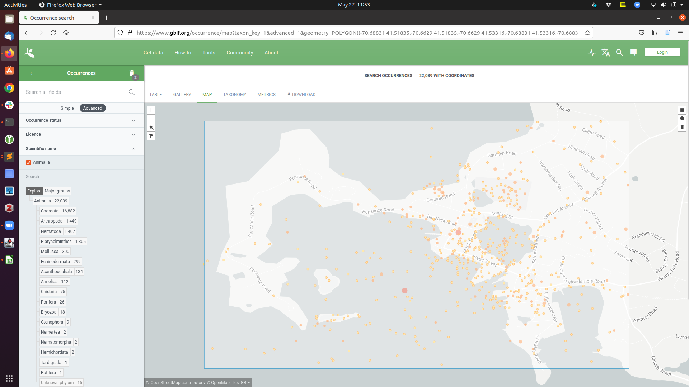

# Comparing phylogenetic trees, gathering date estimates  
Work in progress - please contact ejmctavish@ucmerced.edu with any issues or questions.


There any many ways to generate phylogenetic trees!  
All kinds of data, lots of analysis methods.
We've talked a lot about estimating trees.

**How can we contextualize our phylogenetic inferences in existing literature and taxonomy?**


In this tutorial we will walk through:
  * Standardizing taxon names
  * Getting existing trees for arbitrary sets of taxa
  * Visualizing conflict between estimates
  * Getting date estimates for nodes
  * Updating an existing phylogeny with new data

# The Open Tree of Life
The Open Tree of Life (https://opentreeoflife.github.io/) is a project that unties phylogenetic inferences and taxonomy to provide a synthetic estimate of species relationships across the entire tree of life.  
  


This tree currently includes 2.4 million tips, and is based on 1,330 published studies which include 112,890 unique tips.

The synthetic tree uses a combined taxonomy across a large number of taxonomy resources with evolutionary estimates from published phylogenetic studies.
https://opentreeoflife.github.io/browse/


## The synthetic tree

## Tree Browser

[https://tree.opentreeoflife.org](https://tree.opentreeoflife.org)
is our interactive tree viewer.
You can browse by  the synthetic tree and leave feedback.

### Navigation

Click on nodes to move through the tree.
If you click the "Legend" button at the top, you will get an explanation
    of what information the visual elements of the tree convey.

### Seeing more info about a node

You can reveal the "Properties panel" by clicking on "**ⓘ** Show Properties"
    button or the "**ⓘ**" link that appears when your mouse is over a node or
    branch in the tree.

The properties panel contains:

  * links to the taxon in our reference taxonomy (OTT) and other taxonomies
  * the ID of the node
  * the count of how many tips in the tree descend from the node
  * information about how to download a Newick representation of the subtree
      rooted at that node, and
  * information about taxonomies and phylogenies that support or disagree with
    that node. (e.g. https://tree.opentreeoflife.org/opentree/opentree14.7@mrcaott3089ott32977/Corytophaninae--Leiocephalus)

Clicking on "**ⓘ** Hide Properties" will hide the panel so that you can see more
    of the tree.

### Feedback

If you have feedback about the relationships that you see, use the "Add Comment" button.
Comments that are entered here are stored as issues in our
[feedback repository](https://github.com/OpenTreeOfLife/feedback/issues).


## Taxonomy Browser

[https://tree.opentreeoflife.org/taxonomy/browse](https://tree.opentreeoflife.org/taxonomy/browse?id=93302) is our browser for the Open Tree Taxonomy.
That taxonomy is an input into our full synthetic tree and
is used to help us align tips in different trees that refer to the same taxon.

The taxonomy includes links to unique identifiers in other digitally available taxonomies, such as GBIF or NCBI.


## Accessing data using the website
Check out https://tree.opentreeoflife.org

Search for your favorite organism!
Don't agree with the relationships? Never fear! We'll see how to fix them by uploading new inferences.


You can use the download a subtree of interest directly from the website.


## Getting a tree for your taxa

It is often more useful to access the pruned subtree for just the taxa you are interested in.
In order to do so, you need to map taxon names to unique identifiers.

Cd into the tutorial folder

```
    cd  moledata/TreeUpdatingComparison/tree_comparison_tutorial
```


One of the key challenges of comparing trees across studies is minor differences in names and naming.

A solution to this, is mapping taxon names to unique identifiers using the Open Tree Taxonomic Name Resolution Service (TNRS). There are a few options to use this service including via the API, or the browser based bulk name mapping. 
https://tree.opentreeoflife.org/curator/tnrs/

We will look up a tree of the hydrozoan jellyfish species found right around Woods Hole!



The names of the taxa you will search for this tutorial were
dowloaded from GBIF (GBIF.org (27 May 2022) GBIF Occurrence Download https://doi.org/10.15468/dl.gcmn6n).

The names are in the file `tree_comparison_tutorial/data/WH_hydrozoan_names.txt`  
You can copy it from jetstream, or download it directly to your laptop from https://github.com/snacktavish/TreeUpdatingComparison/blob/master/tree_comparison_tutorial/data/WH_hydrozoan_names.txt)


*Try this*
  * Go to https://tree.opentreeoflife.org/curator/tnrs/
  * Click on "add names", and upload the names file. 
  * In the mapping options section,
    - select 'Cnidarians' to narrow down the possibilities and speed up mapping
  * Click "Map selected names"

Exact matches will show up in green, and can be accepted by clicking "accept exact matches".

A few taxa may still show suggested names. Click through to the taxonomy, and you will see that the name from the GBIF data is listed as a synonym.

Once you have accepted names for each of the taxa, click "save nameset". 

*Make sure your mappings were saved! If you don't 'accept' matches, they don't download.*

Download the zip file to your laptop.
Extract the files.
Take a look at the human readable version (output/main.csv).

main.json contains the the same data in a more computer readable format.

**Transfer the `output/main.csv` file to the tutorial folder on the cluster, and rename it to `WH_jellies.csv`**

### Using API's
You can use the OpenTree API's to get the tree for a subset of taxa directly from the command line

For example:
```
curl -X POST https://api.opentreeoflife.org/v3/tree_of_life/induced_subtree -H "content-type:application/json" -d '{"ott_ids":[662625, 765195, 662618]}'
```
For more on the OpenTree APIs see https://github.com/OpenTreeOfLife/germinator/wiki/Open-Tree-of-Life-Web-APIs


It is often more convenient to manipulate both trees and names within a scripting language.


### Using Python
We will use wrappers available in the python package [OpenTree](https://github.com/OpenTreeOfLife/python-opentree),([McTavish et al 2022](https://academic.oup.com/sysbio/article/70/6/1295/6273200)) to make it easier to work with the Open Tree Api's.

Install the opentree python package:
    ```pip install opentree```


### Getting a subtree
There is a python script in the tutorials folder 'get_synth_subtree.py'. 

This script uses the taxon ids in the file `WH_jellies.csv` you transferred from your computer to get a synthetic tree from the OpenTree APIs. 
If you had trouble with that step you can use `backup_output/WH_jellies.csv` as the input file instead.

The argument 'output' sets the first part of the output filename.

```
     python get_synth_subtree.py --input-file WH_jellies.csv --output WH_jellyfish_synth
```

This script will write two files out to your current working directory - 
the tree in newick format, 'WH_jellyfish_synth.tre' and 'WH_jellyfish_synth_citations.txt' the citations of published trees that went into generating that tree, and support the relationships in it.

Move both those files to your computer.
Open the synthetic subtree in figtree, and the citations in a text viewer.

**Q** *Are any of the genera non-monophyletic? What one(s)?*


**Q** *Look at this genus/genera in the tree viewer (tree.opentreeoflife.org). What studies break the monophyly of each taxon?*


**Q** *Is there conflict among the input sources? Does the alternate resolution demonstrate reciprocal monophyly of these genera?*


## Comparing trees
Imagine that we want to get some more context for our inferences that we made when estimating tree.
How does the tree we estimated compare to taxonomy and other published literature including these taxa?

In order to make comparisons about statements that two different trees are making about the same set of taxa, we need to make sure the labels on the tree match.

I have generated a tree file for you 'turtle_iqtree_OTT.tre' from an IQTtree excercise from a previous year of this course (http://www.iqtree.org/workshop/molevol2019), and labelled it with standardized taxon name labels. 
This was an example data set specifically chosen to be a challenging inference problem, so there are some questions about if the inferred relationships are correct.

You can get a comparison tree from OpenTree using the mapped names file, tutorial/data/turtle_tree_names.csv
Instead of including the name and the ott id on each, tip, we will can download it with the names.

```
    $ python get_synth_subtree.py --input-file data/turtle_tree_names.csv --label-format name --output turtle_synth
```

### Compare two trees visually
Open the synthetic tree (turtle_synth.tre) and the example inferred tree (turtle_iqtree_OTT.tre) in figtree.

**Q** *We lost a taxon! Which one? Why?*

**Q** *Are the relationships in 'turtle_iqtree_OTT.tre' different than the relationships from OpenTree?*

**Q** *How so?*


### Lets take a closer look!

The phylogenetic placement of turtles is contentious ([see Simion et al 2020 for discussion](https://hal.archives-ouvertes.fr/hal-02535366)). Lets look at the lizard/snake realtionships!

You can also pass ott ids into `get_synth_subtree.py` directly. 
The ids for each taxon from the 'turtle_iqtree_OTT.tre' tree are listed in 'data/turtle_tree_names.csv'. 
Or you can search names in the search box at tree.opentreeoflife.org, and get the ott ids from there.

For example, to see the relationships between Python (ott:675102), e.g. *Python regius*, Podarcis (ott:937560), e.g. *Podarcis muralis* ,  
and *Anolis carolinenesis* (ott:705356)  
, ,  .

try running:
```
    $ python get_synth_subtree.py --ott-ids 970153 675102 937560  --output lizards
```


The output tree will be written to lizards.tre.

**Q** *Is there anything surprisng about these relationships? (The answer probably depends on your pre-existing herp phylogeny knowledge :P)*

## Finding published trees that have your taxon or taxa of interest:


You can seach the corpus of trees based on taxon name or taxon id
```
    $ python find_trees.py "Homarus americanus" --property ot:ottTaxonName
```

```
    $ python find_trees.py 937560 --property ot:ottId
```

## Getting date estimates for nodes

This is beta functionality, that we are in the process of adding to the OpenTree services.
The API docs are posted at https://github.com/OpenTreeOfLife/chronosynth/wiki/Draft-API

You can query the study corpus based on either a higher taxon id (e.g. Python ott675102), or an internal node label (e.g. mrcaott1000311ott3643727).

The dates API will return the ages of internal nodes of input trees that align with that node.

e.g.

```
   $ curl -X GET https://dates.opentreeoflife.org/v4/dates/synth_node_age/ott675102
```


The python script get_dates.py translates the short form citations into their full citation information.
It outputs the tree if you input a list of ids, and a date file with age estimates and citations for nodes.

```
   $ python  get_dates.py --ott-ids 970153 675102 937560 --output lizard_ages
```

Open 'lizard_ages_dates.txt'.

**Q** *What are the maximum and minimum age estimates for the root of this three taxon tree?*


**Q** *Is there overlap between the age estimates for the root and for the internal node?*


You can also gather node age data for a single taxon.

```
   $ python  get_dates.py --ott-ids 675102 --output python_ages
```

There is also an R-package to gather date information and estimate dated trees, Datelife, available online at (datelife.opentreeoflife.org).


##  Exercise
  

A student is studying jellyfish that live in Jellyfish Lake in Palau.   
They are in genus 'Mastigias'. She needs to assemble a transcriptome, and wants to use an assembled reference genus.
There are genomic resources available in the genera Cassiopea, Aurelia and Rhopilema.  
*Which genome should they use to assemble their transcriptome?*


**Q** *What are the relationships among these taxa?*

**Q** *Which taxon is most closely related to mastigias?*

**Q** *What studies support this inference?*

One of the genera got renamed! Why?
Look in the synthetic tree, to assess what is happened.  

**Q**  *Which genus is not in the output tree? Why not?*

**Q**  *What phylogenetically supported three-taxon relationship breaks up this genus?*


## Answers to the questions
https://github.com/snacktavish/TreeUpdatingComparison/blob/master/answers/OpenTree_exercise_answers.md
(although some answers could change in future, as the OpenTree synthetic tree is updated with new phylogenetic data)

## Choose your own adventure!
If there is time, try one of the ideas below.

### Get a synthetic tree
Make a list of taxa you are interested in and save it in a text file.
(Scientific names only)

Resolve those names to Open Tree identifiers, and use `get_synth_subtree.py` to get a tree for your taxa of interest.


### Contribute to OpenTree

Take a look at the area of the synthetic tree that is interesting to you.

Do you have, or know of a published tree that would do a better job on those relationships, but it isn't included in the synthetic tree?

Upload it to the main website  https://tree.opentreeoflife.org/curator, and those phylogenetic inferences will be incorporated into later drafts of the synthetic tree!


### Unifying geographic and phylogenetic data using R/Rstudio
There is a great package, [Rotl](https://github.com/ropensci/rotl) that makes it easy to access and work with OpenTree data in R.

Try it out using either:
Tutorial on rotl at, https://ropensci.org/tutorials/rotl_tutorial/
Tutorial on linking data from OpenTree with species locations from GBIF,
https://mctavishlab.github.io/BIO144/labs/rotl-rgbif.html

  

### Unifying geographic and phylogenetic data using python-opentree and Jupyter notebooks


https://github.com/McTavishLab/jupyter_OpenTree_tutorials/blob/master/notebooks/DEMO_OpenTree.ipynb


### Zoom around

Brain a bit tired? There are some fun visualizations of the OpenTree tree.

Take a look around OneZoom https://www.onezoom.org/ tree of life explorer

or this emoji hyperbolic tree https://glouwa.github.io/


---
